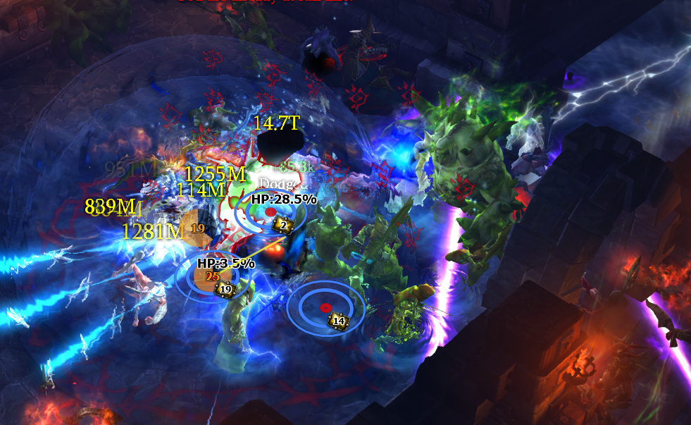

# EliteCirclePlugin

Modification and combination of MonsterCirclePlugin (https://github.com/coreyblackgh/HUD-Plugins) and DiadrasFirstGemPlugin (https://github.com/User5981/Resu)

https://www.ownedcore.com/forums/diablo-3/turbohud/turbohud-community-plugins/612786-international-cb-monstercircleplugin.html

https://www.ownedcore.com/forums/diablo-3/turbohud/turbohud-community-plugins/653210-v7-6-international-resu-diadrasfirstgemplugin.html

Installation
------------
Copy **EliteCirclePlugin.cs** to TurboHUD\plugins\Default\

To use this plugin, you need **remove original** version of MonsterCirclePlugin and DiadrasFirstGemPlugin.

Original Features
------------
+ Show circle at elite
+ Shows stacks when you have Bane of the Stricken equipped

Mod Features
------------
+ Remove unnecessary display information
+ Show HP of elite when Elite's HP < 40%
+ Show direction Direction Line to elite when Elite's HP < 20%
+ Code optimization

Screenshot
------------

