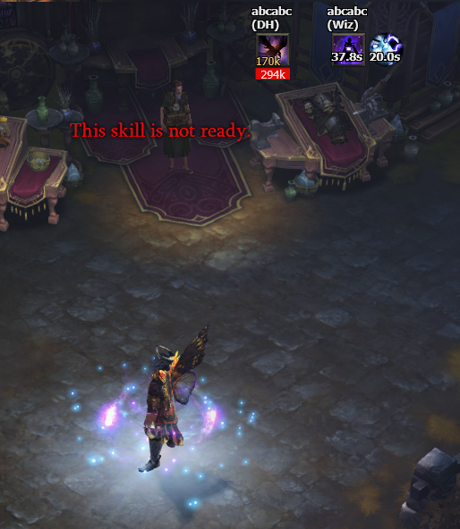

# PartyCooldownsPlugin

Modification of PartyCooldownsPlugin 
( **The original is not mine** )

https://github.com/RuneBarrett/ThudPlugins 

https://www.ownedcore.com/forums/diablo-3/turbohud/turbohud-community-plugins/634515-v7-3-international-runeb-partycooldownsplugin.html

Installation
------------
Copy PartyCooldownsPlugin.cs to TurboHUD\plugins\Default\

To use this plugin, you need **remove original version of PartyCooldownsPlugin**.

Original Features
------------
+ Shows the remaining cooldown on chosen party member skills

Mod Features
------------
+ Shows Archon Skill (without any bug and exceptions, i fixed all bug)
+ Show Cheat Death with cooldown (only show when it proc)

Screenshot
------------

