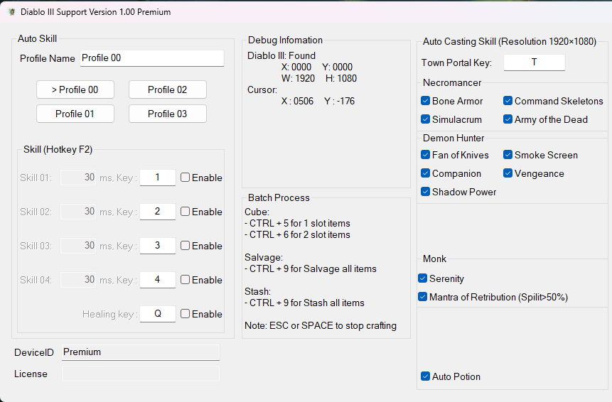
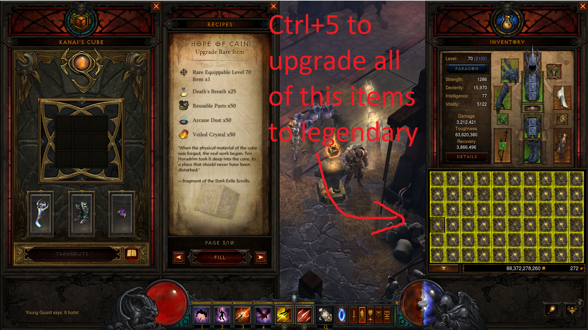
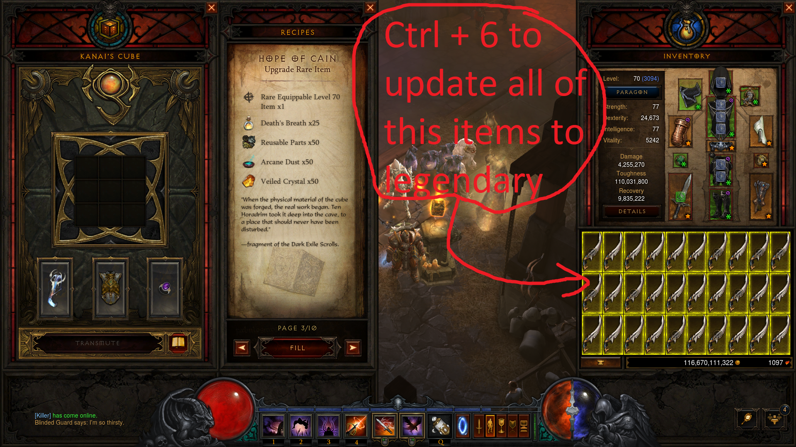
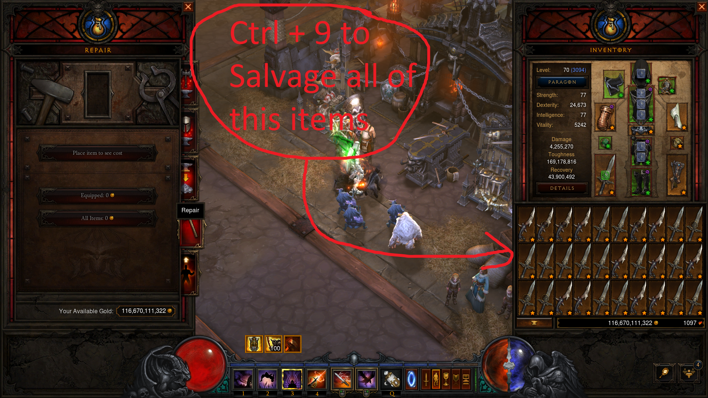

# Diablo III Support tool
An open-source Dialo III Support tool (Full - Free - Open Source)

Link download (Source code + Tool)
------------
Latest stable version

https://github.com/langmaninternet/DialoIIISupport/releases

If you get error with mfc140u.dll , install Visual C++ Redistributable for Visual Studio 2022

Features : Auto use skill over time with smart handling situations
------------

F1 to on/off auto left mouse click

F2 to on/off auto skill 1 2 3 4 an healing Q (On Full-HD Resolution, F2 auto stop at town)

F3 to on/off auto right mouse click

F4 to on/off auto hold right mouse 

Features : Cube converter
------------

Craft 30/60 rare item, go to Cube, open page 3. 

Press CTRL + 5 for 1 slot items,  

CTRL + 6 for 2 slot items .

CTRL + 9 if you want to clear the Inventory at the Blacksmith

ESC or SPACE to Stop 

Premium Features : Auto Skill
------------
Smart Auto Press for Skill on Battle
+ BoneArmor
+ Simulacrum
+ Companion
+ FanOfKnives
+ SmokeScreen
+ Vengeance

Only work on
+ Resolution is 1920 × 1080 
+ Game is Fullscreen or Fullscreen Windows Mode

Premium Features : Auto Roll
------------
Auto Roll Support
+ BoneArmor
+ Simulacrum
+ Companion
+ FanOfKnives
+ SmokeScreen
+ Vengeance

Only work on
+ Resolution is 1920 × 1080 
+ Game is Fullscreen or Fullscreen Windows Mode

Screenshot
------------

